# M5Unified
### M5Stack Series unified library .

#### How To Use
[Please see examples/Basic/HowToUse](examples/Basic/HowToUse/HowToUse.ino)

## Supported framework
 - ESP-IDF
 - Arduino for ESP32

## Supported device (ESP32)
 - M5Stack BASIC / GRAY / GO / FIRE
 - M5Stack Core2 /Core2 v1.1 / Tough
 - M5Stick C / CPlus / CPlus2
 - M5Stack CoreInk
 - M5Station
 - M5Paper
 - M5ATOM Lite / Matrix / ECHO / PSRAM / U
 - M5STAMP PICO

## Supported device (ESP32S3)
 - M5Stack CoreS3
 - M5ATOMS3 / S3Lite / S3U
 - M5STAMPS3
 - M5Dial
 - M5DinMeter
 - M5Capsule
 - M5Cardputer

## Supported device (ESP32C3)
 - M5STAMPC3 / C3U

## Supported device (external display)
 - Unit LCD
 - Unit OLED
 - Unit Mini OLED
 - Unit RCA
 - Unit GLASS
 - Unit GLASS2
 - ATOM Display (with M5ATOM Lite / Matrix / PSRAM / S3 / S3Lite)
 - Module Display (with M5Stack / Core2 / Tough)
 - Module RCA (with M5Stack / Core2 / Tough)

## Supported device (external speaker)
 - SPK HAT (with M5StickC / CPlus / M5Stack CoreInk)
 - SPK HAT2 (with M5StickCPlus)
 - ATOMIC SPK (with M5ATOM Lite / PSRAM / ATOMS3 / S3Lite)
 - Module Display (with M5Stack / Core2 / Tough)
 - Module RCA (with M5Stack / Core2 / Tough)

## Supported device (external unit)
 - Unit RTC
 - Unit IMU

# H/W infomation

### ESP32 GPIO list
|                    |M5Stack BASIC GRAY           |M5Stack GO/FIRE                 |M5Stack Core2(AWS) Tough         |M5Stick C/CPlus            |M5Stick CPlus2          |M5Stack CoreInk      |M5Paper                |M5Station              |M5ATOM Lite/Matrix ECHO/U PSRAM |M5STAMP PICO     |                    |
|:------------------:|:---------------------------------:|:---------------------------------:|:-------------------------------------:|:----------------------------:|:-------------------------:|:----------------------:|:---------------------:|:---------------------:|:---------------------------------------:|:------------------:|:------------------:|
|GPIO 0 `ADC2_CH1`|`M-Bus` IIS_MK                  |`M-Bus` IIS_MK                  |`M-Bus` **SPK_LRCK PDM_C**(Core2)|`HAT` `PAD` **PDM_C**   |`HAT` **PDM_C**         |**EPD_RST**             | ---                   | ---                   | ---                                     |                    |GPIO 0 `ADC2_CH1`|
|GPIO 1 `USB_TX`  |`M-Bus` **Serial**              |`M-Bus` **Serial**              |`M-Bus` **Serial**                  |**Serial**                    |**Serial**                 |**Serial**              |**Serial**             |**Serial**             |**Serial**                               |**Serial**          |GPIO 1 `USB_TX`  |
|GPIO 2 `ADC2_CH2`|`M-Bus`                         |`M-Bus`                         |`M-Bus` **SPK_D**                   |`PAD` **Beep**(CPlus)      |**Beep**                   |**Beep**                |**PW_Hold**            |**ReadEn**             | ---                                     | ---                |GPIO 2 `ADC2_CH2`|
|GPIO 3 `USB_RX`  |`M-Bus` **Serial**              |`M-Bus` **Serial**              |`M-Bus` **Serial**                  |**Serial**                    |**Serial**                 |**Serial**              |**Serial**             |**Serial**             |**Serial**                               |**Serial**          |GPIO 3 `USB_RX`  |
|GPIO 4 `ADC2_CH0`|**TF_CS**                          |**TF_CS**                          |**TF_CS**                              | ---                          |**PW_Hold**                |**EPD_BUSY**            |**TF_CS**              |**RGB LED**            | ---                                     | ---                |GPIO 4 `ADC2_CH0`|
|GPIO 5              |`M-Bus`                            |`M-Bus`                            |**LCD_CS**                             |**LCD_CS**                    |**LCD_CS**                 |**BTN_HAT**             |**EXT_5V**             |**LCD_CS**             |`Bus`(P) **PDM_C**(U)                 | ---                |GPIO 5              |
|GPIO 9              | ---                               | ---                               | ---                                   |**InfraRed**                  | ---                       |**EPD_CS**              | ---                   | ---                   | ---                                     | ---                |GPIO 9              |
|GPIO10              | ---                               | ---                               | ---                                   |**LED**                       | ---                       |**LED**                 | ---                   | ---                   | ---                                     | ---                |GPIO10              |
|GPIO12 `ADC2_CH5`|`M-Bus` IIS_SK                  |`M-Bus` IIS_SK                  |**SPK_BCLK**                           | ---                          |**LCD_RST**                |**PW_Hold**             |**SPI_MOSI**           |**USB_PW**             |**InfraRed**                             | ---                |GPIO12 `ADC2_CH5`|
|GPIO13 `ADC2_CH4`|`M-Bus` IIS_WS                  |`M-Bus` IIS_WS                  |`M-Bus` RXD2                        |**SPI_SCLK**                  |**SPI_SCLK**               |`MI-Bus` RXD2        |**SPI_MISO**           |`PORT.C1`              | ---                                     | ---                |GPIO13 `ADC2_CH4`|
|GPIO14 `ADC2_CH6`|**LCD_CS**                         |**LCD_CS**                         |`M-Bus` TXD2                        | ---                          |**LCD_D/C**                |`MI-Bus` TXD2        |**SPI_SCLK**           |`PORT.C1`              | ---                                     | ---                |GPIO14 `ADC2_CH6`|
|GPIO15 `ADC2_CH3`|`M-Bus` IIS_OUT                 |`M-Bus` **RGB LED**             |**LCD_D/C**                            |**SPI_MOSI**                  |**SPI_MOSI**               |**EPD_D/C**             |**EPD_CS**             |**LCD_RST**            | ---                                     | ---                |GPIO15 `ADC2_CH3`|
|GPIO16 `PSRAM`   |`M-Bus` RXD2                    |`M-Bus` `PORT.C` RXD2        | ---                                   | ---                          |---                        | ---                    | ---                   |`PORT.C2` RXD2      | ---                                     | ---                |GPIO16 `PSRAM`   |
|GPIO17 `PSRAM`   |`M-Bus` TXD2                    |`M-Bus` `PORT.C` TXD2        | ---                                   | ---                          |---                        | ---                    | ---                   |`PORT.C2` TXD2      | ---                                     | ---                |GPIO17 `PSRAM`   |
|GPIO18              |`M-Bus` **SPI_SCLK**            |`M-Bus` **SPI_SCLK**            |**SPI_SCLK**                           |**LCD_RST**                   |---                        |`MI-Bus` **SPI_SCLK**|`PORT.C`               |**SPI_SCLK**           | ---                                     |                    |GPIO18              |
|GPIO19              |`M-Bus` **SPI_MISO**            |`M-Bus` **SPI_MISO**            |`M-Bus`                                | ---                          |**LED** **InfraRed**    |**RTC_INT**             |`PORT.C`               |LCD_D/C                |`Bus` **SPK_C**(ECHO) ***PDM_D**(U)|                    |GPIO19              |
|GPIO21              |`M-Bus` `PORT.A` **I2C0_SDA**|`M-Bus` `PORT.A` **I2C0_SDA**|**I2C1_SDA**                           |**I2C1_SDA**                  |**I2C1_SDA**               |`MI-Bus` **I2C1_SDA**|**I2C1_SDA**           |**I2C1_SDA**           |`Bus` **I2C1_SCL**                    |                    |GPIO21              |
|GPIO22              |`M-Bus` `PORT.A` **I2C0_SCL**|`M-Bus` `PORT.A` **I2C0_SCL**|**I2C1_SCL**                           |**I2C1_SCL**                  |**I2C1_SCL**               |`MI-Bus` **I2C1_SCL**|**I2C1_SCL**           |**I2C1_SCL**           |`Bus` **SPK_D**(ECHO)                 |                    |GPIO22              |
|GPIO23              |`M-Bus` **SPI_MOSI**            |`M-Bus` **SPI_MOSI**            |**SPI_MOSI**                           |**LCD_D/C**                   | ---                       |`MI-Bus` **SPI_MOSI**|**EPD_RST**            |**SPI_MOSI**           |`Bus` **PDM_D**(ECHO)                 | ---                |GPIO23              |
|GPIO25 `DAC1`    |`M-Bus` **SPK_DAC**             |`M-Bus` **SPK_DAC**             |`M-Bus` **RGB LED**(AWS)            |`HAT`(CPlus) `PAD`         |`HAT`                      |`MI-Bus` `HAT`       |`PORT.A` I2C0_SDA   |`PORT.B1`              |`Bus` **I2C1_SDA**                    |                    |GPIO25 `DAC1`    |
|GPIO26 `DAC2`    |`M-Bus`                            |`M-Bus` `PORT.B`                |`M-Bus`                                |`HAT` `PAD`                |`HAT`                      |`MI-Bus` `HAT`       |`PORT.B`               |`PORT.B2`              |`PORT.A` **I2C0_SDA**                 |                    |GPIO26 `DAC2`    |
|GPIO27 `ADC2_CH7`|**LCD_D/C**                        |**LCD_D/C**                        |`M-Bus`                                |**AXP192 VBUSEN**             |**LCD_BL**                 |**BTN_PWR**             |**EPD_BUSY**           |**IMU_INT**            |**RGB LED**                              |**RGB LED**         |GPIO27 `ADC2_CH7`|
|GPIO32 `ADC1_CH4`|**LCD_BL**                         |**LCD_BL**                         |`M-Bus` `PORT.A` I2C0_SDA        |`PORT.A` I2C0_SDA          |`PORT.A` I2C0_SDA       |`PORT.A` I2C0_SDA    |`PORT.A` I2C0_SCL   |`PORT.A` I2C0_SDA   |`PORT.A` **I2C0_SCL**                 |`PORT.A` I2C0_SDA|GPIO32 `ADC1_CH4`|
|GPIO33 `ADC1_CH5`|**LCD_RST**                        |**LCD_RST**                        |`M-Bus` `PORT.A` I2C0_SCL        |`PORT.A` I2C0_SCL          |`PORT.A` I2C0_SCL       |`PORT.A` I2C0_SCL    |`PORT.B`               |`PORT.A` I2C0_SCL   |`Bus` **PDM_C**(ECHO)                 |`PORT.A` I2C0_SCL|GPIO33 `ADC1_CH5`|
|GPIO34 `ADC1_CH6`|`M-Bus` IIS_IN                  |`M-Bus` **MIC_ADC** IIS_IN   |`M-Bus` **PDM_D**(Core2)            |**PDM_D**                     |**PDM_D**                  |`MI-Bus` **SPI_MISO**| ---                   | USB Current?          |                                         | ---                |GPIO34 `ADC1_CH6`|
|GPIO35 `ADC1_CH7`|`M-Bus`                            |`M-Bus`                            |`M-Bus`                                |**RTC_INT**                   |**BTN_PWR**                |**BAT_V**               |**BAT_V**              |`PORT.B1`              | ---                                     | ---                |GPIO35 `ADC1_CH7`|
|GPIO36 `ADC1_CH0`|`M-Bus`                            |`M-Bus` `PORT.B`                |`M-Bus`                                |`HAT` `PAD`                |`HAT`                      |`MI-Bus` `HAT`       |**TP_INT**             |`PORT.B2`              | ---                                     | ---                |GPIO36 `ADC1_CH0`|
|GPIO37 `ADC1_CH1`|**BTN_C**                          |**BTN_C**                          | ---                                   |**BTN_A**                     |**BTN_A**                  |**SW_Up**               |**SW_Up**              |**BTN_A**              | ---                                     | ---                |GPIO37 `ADC1_CH1`|
|GPIO38 `ADC1_CH2`|**BTN_B**                          |**BTN_B**                          |`M-Bus` **SPI_MISO**                |`PAD`                         |**BAT_V**                  |**SW_Press**            |**SW_Press**           |**BTN_B**              | ---                                     | ---                |GPIO38 `ADC1_CH2`|
|GPIO39 `ADC1_CH3`|**BTN_A**                          |**BTN_A**                          |**TP_INT**                             |**BTN_B**                     |**BTN_B**                  |**SW_Down**             |**SW_Down**            |**BTN_C**              |**BTN**                                  |**BTN**             |GPIO39 `ADC1_CH3`|
|                    |M5Stack BASIC GRAY           |M5Stack GO/FIRE                 |M5Stack Core2(AWS) Tough         |M5Stick C/CPlus            |M5Stick CPlus2          |M5Stack CoreInk      |M5Paper                |M5Station              |M5ATOM Lite/Matrix ECHO/U PSRAM |M5STAMP PICO     |                    |

### ESP32C3 GPIO list
|               |M5Stamp C3            |M5Stamp C3U                  |               |
|:-------------:|:-----------------------:|:------------------------------:|:-------------:|
|GPIO 0         |`PORT.A` **I2C0_SCL** |`PORT.A` **I2C_SCL**         |GPIO 0         |
|GPIO 1         |`PORT.A` **I2C0_SDA** |`PORT.A` **I2C_SDA**         |GPIO 1         |
|GPIO 2         |**RGB LED**              |**RGB LED**                     |GPIO 2         |
|GPIO 3         |**BTN_A**                |`Bus`                           |GPIO 3         |
|GPIO 4         |`Bus`                    |`Bus`                           |GPIO 4         |
|GPIO 5         |`Bus`                    |`Bus`                           |GPIO 5         |
|GPIO 6         |`Bus`                    |`Bus`                           |GPIO 6         |
|GPIO 7         |`Bus`                    |`Bus`                           |GPIO 7         |
|GPIO 8         |`Bus`                    |`Bus`                           |GPIO 8         |
|GPIO 9         | ---                     |**BTN_A**                       |GPIO 9         |
|GPIO10         |`Bus`                    |`Bus`                           |GPIO10         |
|GPIO18 `USB`|`PORT.U` **D-**       |`USB` `PORT.U` **D-**     |GPIO18 `USB`|
|GPIO19 `USB`|`PORT.U` **D+**       |`USB` `PORT.U` **D+**     |GPIO19 `USB`|
|GPIO20         |`USB` **Serial**      |`Bus`                        |GPIO20         |
|GPIO21         |`USB` **Serial**      |`Bus`                        |GPIO21         |
|               |M5Stamp C3            |M5Stamp C3U                  |               |

### ESP32S3 GPIO list
|               |M5Stack CoreS3                |M5ATOMS3  / S3Lite    |M5ATOMS3U                | M5STAMPS3                         | M5Dial                   | M5Capsule                | M5Cardputer              |               |
|:-------------:|:-------------------------------:|:-----------------------:|:-----------------------:|:---------------------------------:|:------------------------:|:------------------------:|:------------------------:|:-------------:|
|GPIO 0         |`M-Bus` **SPK_LRCK**          | ---                     | ---                     | `Bus` **BTN_A**                | ---                      | ---                      | **BTN_A**                |GPIO 0         |
|GPIO 1         |`PORT.A` **I2C0_SCL**         |`PORT.A` **I2C0_SCL** |`PORT.A` **I2C0_SCL** | `Bus`                             | `PORT.B`                 | ---                      | `PORT.A` **I2C0_SCL** |GPIO 1         |
|GPIO 2         |`PORT.A` **I2C0_SDA**         |`PORT.A` **I2C0_SDA** |`PORT.A` **I2C0_SDA** | `Bus`                             | `PORT.B`                 | **Beep**                 | `PORT.A` **I2C0_SDA** |GPIO 2         |
|GPIO 3         |**LCD_CS**                       |vdd3v3                   |vdd3v3                   | `Bus`                             | **Beep**                 | ---                      | **KEY_MATRIX**           |GPIO 3         |
|GPIO 4         |**TF_CS**                        |**InfraRed**             | ---                     | `Bus`                             | **LCD_RS**               | **InfraRed**             | **KEY_MATRIX**           |GPIO 4         |
|GPIO 5         |`M-Bus`                          |`Bus`                    | ---                     | `Bus`                             | **LCD_MOSI**             | ---                      | **KEY_MATRIX**           |GPIO 5         |
|GPIO 6         |`M-Bus`                          |`Bus`                    | ---                     | `Bus`                             | **LCD_SCK**              | **BAT_ADC**              | **KEY_MATRIX**           |GPIO 6         |
|GPIO 7         |`M-Bus`                          |`Bus`                    | ---                     | `Bus`                             | **LCD_CS**               | ---                      | **KEY_MATRIX**           |GPIO 7         |
|GPIO 8         |`M-Bus` `PORT.B`              |`Bus`                    | ---                     | `Bus`                             | **LCD_RST**              | **I2C1_SDA**             | **KEY_MATRIX**           |GPIO 8         |
|GPIO 9         |`M-Bus` `PORT.B`              | ---                     | ---                     | `Bus`                             | **LCD_BL**               | ---                      | **KEY_MATRIX**           |GPIO 9         |
|GPIO10         |`M-Bus`                          | ---                     | ---                     | `Bus`                             | **RFID_INT**             | **I2C1_SCL**             | **BAT_ADC**              |GPIO10         |
|GPIO11         |**I2C1_SCL**                     | ---                     | ---                     | `Bus`                             | **I2C1_SDA**             | **TF_CS**                | **KEY_MATRIX**           |GPIO11         |
|GPIO12         |**I2C1_SDA**                     | ---                     |**InfraRed**             | `Bus`                             | **I2C1_SCL**             | **TF_MOSI**              | **TF_CS**                |GPIO12         |
|GPIO13         |`M-Bus` **SPK_D**             | ---                     | ---                     | `Bus` `PORT.A` **I2C0_SDA** | `PORT.A` **I2C0_SDA** | `PORT.A` **I2C0_SDA** | **KEY_MATRIX**           |GPIO13         |
|GPIO14         |`M-Bus` **MIC_IN**            | ---                     |`Bus`                    | `Bus`                             | **TP_INT**               | **TF_CLK**               | **TF_MOSI**              |GPIO14         |
|GPIO15         |**CAM_D6**                       |**LCD_CS**               | ---                     | `Bus` `PORT.A` **I2C0_SCL** | `PORT.A` **I2C0_SCL** | `PORT.A` **I2C0_SCL** | **KEY_MATRIX**           |GPIO15         |
|GPIO16         |**CAM_D7**                       |**LCD_BL**               | ---                     | `FPC`                             | ---                      | ---                      | ---                      |GPIO16         |
|GPIO17         |`M-Bus` `PORT.C`              |**LCD_SCLK**             |`Bus`                    | `FPC`                             | ---                      | ---                      | ---                      |GPIO17         |
|GPIO18         |`M-Bus` `PORT.C`              | ---                     | ---                     | `FPC`                             | ---                      | ---                      | ---                      |GPIO18         |
|GPIO19 `USB`|`USB` **D--**                 |`USB` **D--**         |`USB` **D--**         | `USB` **D--**                  | `USB` **D--**         | `USB` **D--**         | `USB` **D--**         |GPIO19 `USB`|
|GPIO20 `USB`|`USB` **D++**                 |`USB` **D++**         |`USB` **D++**         | `USB` **D++**                  | `USB` **D++**         | `USB` **D++**         | `USB` **D++**         |GPIO20 `USB`|
|GPIO21         |**I2C_INT**                      |**LCD_MOSI**             | ---                     | **RGB LED**                       | **RGB LED**              | **RGB LED**              | **RGB_LED**              |GPIO21         |
|GPIO33         |**SPK_WCK**                      |**LCD_DC**               | ---                     | `FPC`                             | ---                      | ---                      | **LCD_RST**              |GPIO33         |
|GPIO34         |**SPK_BCK**                      |**LCD_RST**              | ---                     | `FPC`                             | ---                      | ---                      | **LCD_RS**               |GPIO34         |
|GPIO35         |`M-Bus` **SPI_MISO LCD DC**|**RGB LED**              |**RGB LED**              | `FPC`                             | ---                      | ---                      | **LCD_DAT**              |GPIO35         |
|GPIO36         |`M-Bus` **SPI_SCLK**          | ---                     | ---                     | `FPC`                             | ---                      | ---                      | **LCD_SCK**              |GPIO36         |
|GPIO37         |`M-Bus` **SPI_MOSI**          | ---                     | ---                     | `FPC`                             | ---                      | ---                      | **LCD_CS**               |GPIO37         |
|GPIO38         |**CAM_HREF**                     |`Bus` **I2C1_SDA**    |**PDM_DAT**              | `FPC`                             | ---                      | ---                      | **LCD_BL**               |GPIO38         |
|GPIO39         |**CAM_D2**                       |`Bus` **I2C1_SCL**    |**PDM_CLK**              | `Bus`                             | ---                      | **TF_MISO**              | **TF_MISO**              |GPIO39         |
|GPIO40         |**CAM_D3**                       | ---                     |`Bus`                    | `Bus`                             | **ENCODER_B**            | **MIC_CLK**              | **TF_CLK**               |GPIO40         |
|GPIO41         |**CAM_D4**                       |**BTN_A**                |**BTN_A**                | `Bus`                             | **ENCODER_A**            | **MIC_DAT**              | **SPK_BCLK**             |GPIO41         |
|GPIO42         |**CAM_D5**                       | ---                     |`Bus`                    | `Bus`                             | **BTN_A**                | **BTN_A**                | **SPK_SDATA**            |GPIO42         |
|GPIO43         |`M-Bus` **SerialTX**          | ---                     | ---                     | `Bus`                             | ---                      | ---                      | **I2S_LRCLK**            |GPIO43         |
|GPIO44         |`M-Bus` **SerialRX**          | ---                     | ---                     | `Bus`                             | ---                      | ---                      | **InfraRed**             |GPIO44         |
|GPIO45         |**CAM_PCLK**                     | ---                     | ---                     | ---                               | ---                      | ---                      | ---                      |GPIO45         |
|GPIO46         |**CAM_VSYNC**                    | ---                     | ---                     | `Bus`                             | **HOLD**                 | **HOLD**                 | **MIC_DAT**              |GPIO46         |
|GPIO47         |**CAM_D9**                       | ---                     | ---                     | ---                               | ---                      | ---                      | ---                      |GPIO47         |
|GPIO48         |**CAM_D8**                       | ---                     | ---                     | ---                               | ---                      | ---                      | ---                      |GPIO48         |
|               |M5Stack CoreS3                |M5ATOMS3  / S3Lite    |M5ATOMS3U                | M5STAMPS3                         | M5Dial                   | M5Capsule                | M5Cardputer              |               |

### AXP192 usage
|              |M5Stack Core2   |M5Stack Tough   |M5Stick C    |M5Stick CPlus|  M5Station  |              |
|:------------:|:-----------------:|:-----------------:|:--------------:|:--------------:|:-----------:|:------------:|
|GPIO0 LDO0 |BUS PW EN          |BUS PW EN          |MIC VCC         |MIC VCC         |PortA1.A2 EN |GPIO0 LDO0 |
| GPIO1        |SYS LED            |TP RST             | ---            | ---            |PortB1 EN    | GPIO1        |
| GPIO2        |SPK EN             |SPK EN             | ---            | ---            |PortB2 EN    | GPIO2        |
| GPIO3        | ---               | ---               | ---            | ---            |PortC1 EN    | GPIO3        |
| GPIO4        |LCD RST TP RST  |LCD RST            | ---            | ---            |PortC2 EN    | GPIO4        |
| EXTEN        |PORT 5V EN         |PORT 5V EN         |PORT 5V EN      |PORT 5V EN      |PORT 5V EN   | EXTEN        |
| BACKUP       |RTC BAT            |RTC BAT            |RTC BAT         |RTC BAT         | ---         | BACKUP       |
| LDO1         |RTC VDD            |RTC VDD            |RTC VDD         |RTC VDD         |RTC VDD      | LDO1         |
| LDO2         |LCD PW Periph PW|LCD PW Periph PW|LCD BL          |LCD BL          | ---         | LDO2         |
| LDO3         |VIB MOTOR          |LCD BL             |LCD PW          |LCD PW          |LCD BL       | LDO3         |
| DCDC1        |ESP32 VDD          |ESP32 VDD          |ESP32 VDD       |ESP32 VDD       |ESP32 VDD    | DCDC1        |
| DCDC2        | ---               | ---               | ---            | ---            | ---         | DCDC2        |
| DCDC3        |LCD BL             | ---               | ---            | ---            | ---         | DCDC3        |

### AXP2101 usage
|           |M5Stack Core2v1.1  |M5Stack CoreS3  |           |
|:---------:|:--------------------:|:-----------------:|:---------:|
| ALDO1     | ---                  |VDD 1v8            | ALDO1     |
| ALDO2     |LCD RST               |VDDA 3v3           | ALDO2     |
| ALDO3     |SPK EN                |CAM 3v3            | ALDO3     |
| ALDO4     |Periph PW TF,TP,LCD|TF 3v3             | ALDO4     |
| BLDO1     |LCD BL                |AVDD               | BLDO1     |
| BLDO2     |PORT 5V EN            |DVDD               | BLDO2     |
| DLDO1/DC1 |VIB MOTOR             |LCD BL             | DLDO1/DC1 |
| DLDO2/DC2 | ---                  | ---               | DLDO2/DC2 |
| BACKUP    |RTC BAT               |RTC BAT            | BACKUP    |

### PinMap

<TABLE>
 <TR>
  <TH></TH>
  <TH width="33%">M5Stack BASIC/GRAY GO/FIRE FACES II</TH>
  <TH width="33%">M5Stack Core2 Core2AWS TOUGH</TH>
  <TH width="33%">M5Stack CoreS3</TH>
 </TR>
 <TR align="center">
  <TD rowspan="2">Bus</TD>
  <TD> M-Bus</TD>
  <TD>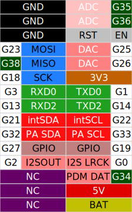 M-Bus</TD>
  <TD> M-Bus</TD>
 </TR>
 <TR align="center">
  <TD colspan="3">
  ※ HPWR=not connected to the ESP32.
   Used by modules capable of supplying 12V power.
  </TD>
 </TR>
</TABLE>

<TABLE>
 <TR>
  <TH></TH>
  <TH width="16%">M5Stack BASIC/GRAY GO/FIRE FACES II</TH>
  <TH width="16%">M5Stack Core2 Core2AWS TOUGH</TH>
  <TH width="16%">M5Stack CoreS3</TH>
  <TH width="16%"> M5Paper </TH>
  <TH width="32%" colspan="2"> M5Station </TH>
 </TR>
 <TR align="center">
  <TD>PortA</TD>
  <TD> PortA</TD>
  <TD> PortA</TD>
  <TD> PortA</TD>
  <TD>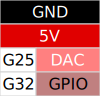 PortA</TD>
  <TD colspan="2"> PortA</TD>
 </TR>
 <TR align="center">
  <TD>PortB</TD>
  <TD> PortB</TD>
  <TD>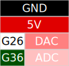 PortB</TD>
  <TD> PortB</TD>
  <TD>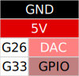 PortB</TD>
  <TD>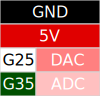 PortB1</TD>
  <TD> PortB2</TD>
 </TR>
 <TR align="center">
  <TD>PortC</TD>
  <TD>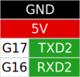 PortC</TD>
  <TD>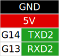 PortC</TD>
  <TD> PortC</TD>
  <TD>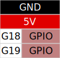 PortC</TD>
  <TD> PortC1</TD>
  <TD>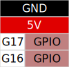 PortC2</TD>
 </TR>
 <TR align="center">
  <TD>PortD</TD>
  <TD>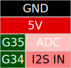 PortD</TD>
  <TD>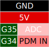 PortD</TD>
  <TD></TD>
  <TD></TD>
  <TD colspan="2"></TD>
 </TR>
 <TR align="center">
  <TD>PortE</TD>
  <TD>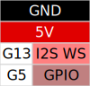 PortE</TD>
  <TD>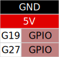 PortE / 485 TOUGH485:12V</TD>
  <TD></TD>
  <TD></TD>
  <TD colspan="2"></TD>
 </TR>
</TABLE>

<TABLE>
 <TR>
  <TH></TH>
  <TH width="11%">M5Stick C</TH>
  <TH width="11%">M5Stick C Plus</TH>
  <TH width="18%">M5Stack CoreInk</TH>
  <TH width="18%">M5Stamp PICO</TH>
  <TH width="18%">M5Stamp C3</TH>
  <TH width="18%">M5Stamp C3U</TH>
 </TR>
 <TR align="center">
  <TD>PortA</TD>
  <TD colspan="4"></TD>
  <TD></TD>
  <TD></TD>
 </TR>
 <TR align="center">
  <TD>HAT</TD>
  <TD>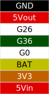</TD>
  <TD>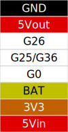</TD>
  <TD>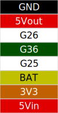</TD>
  <TD></TD>
  <TD></TD>
  <TD></TD>
 </TR>
 <TR align="center">
  <TD>Bus</TD>
  <TD></TD>
  <TD></TD>
  <TD>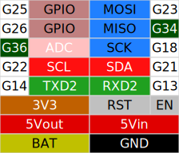 MI-Bus</TD>
  <TD>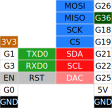</TD>
  <TD></TD>
  <TD></TD>
 </TR>
</TABLE>

<TABLE>
 <TR>
  <TH></TH>
  <TH width="20%">ATOM Lite</TH>
  <TH width="20%">ATOM Matrix</TH>
  <TH width="20%">ATOM ECHO</TH>
  <TH width="20%">ATOM PSRAM</TH>
  <TH width="16%">ATOM U</TH>
 </TR>
 <TR align="center">
  <TD>PortA</TD>
  <TD colspan="5"></TD>
 </TR>
 <TR align="center">
  <TD>Bus</TD>
  <TD></TD>
  <TD>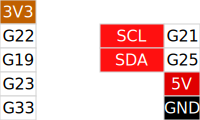</TD>
  <TD></TD>
  <TD>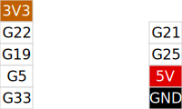</TD>
  <TD>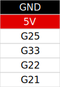</TD>
 </TR>
</TABLE>

<TABLE>
 <TR>
  <TH></TH>
  <TH>ATOMS3 /S3Lite</TH>
 </TR>
 <TR align="center">
  <TD>PortA</TD>
  <TD></TD>
 </TR>
 <TR align="center">
  <TD>Bus</TD>
  <TD></TD>
 </TR>
</TABLE>

### SPI device

|                |M5Stack BASIC GRAY GO/FIRE|M5Stack Core2 Tough      |M5Stick C                 |M5Stick CPlus               |M5Stack CoreInk                |M5Paper                       |                |
|:--------------:|:---------------------------------:|:-----------------------------:|:---------------------------:|:-----------------------------:|:--------------------------------:|:----------------------------:|:--------------:|
| Display        |`ILI9342C` 320×240 CS:G14   |`ILI9342C` 320×240 CS:G5|`ST7735S` 80×160 CS:G5|`ST7789V2` 135×240 CS:G5|`GDEW0154M09` 200×200 CS:G9|`IT8951` 960×540 CS:G15| Display        |
| TF Card        |CS:4                               |CS:4                           | ---                         | ---                           | ---                              |CS:4                          | TF Card        |

### I2C device

|                             |M5Stack BASIC/GRAY GO/FIRE   |M5Stack Core2      |M5Stack Tough    |M5Stack CoreS3  |M5Stick C CPlus|M5Stack CoreInk |M5Paper              |ATOM Matrix  |M5Station                    |                             |
|:---------------------------:|:---------------------------------:|:--------------------:|:------------------:|:-----------------:|:-------------------:|:-----------------:|:-------------------:|:--------------:|:---------------------------:|:---------------------------:|
|Touch Panel               | ---                               |`FT6336U` 38h      |`CHSC6540` 2Eh   |`FT5xxx` 38h    | ---                 | ---               |`GT911` 14h or 5Dh| ---            | ---                         |Touch Panel               |
|RTC                          | ---                               |`BM8563` 51h       |`BM8563` 51h     |`BM8563` 51h    |`BM8563` 51h      |`BM8563` 51h    |`BM8563` 51h      | ---            |`BM8563` 51h              |RTC                          |
|Power Manage              |`IP5306` 75h                    |`AXP192` 34h       |`AXP192` 34h     |`AXP2101` 34h   |`AXP192` 34h      | ---               | ---                 | ---            |`AXP192` 34h              |Power Manage              |
|IMU                          |`MPU6886` 68h                   |`MPU6886` 68h (Ext)| ---                |`BMI270` 69h    |`MPU6886` 68h     | ---               | ---                 |`MPU6886` 68h|`MPU6886` 68h (opt)       |IMU                          |
|IMU (old lot)             |`SH200Q` 6Ch                    | ---                  | ---                | ---               |`SH200Q` 6Ch      | ---               | ---                 | ---            | ---                         |IMU (old lot)             |
|ENV                          | ---                               | ---                  | ---                |`LTR553ALS` 23h | ---                 | ---               |`SHT30` 44h       | ---            | ---                         |ENV                          |
|EEPROM                       | ---                               | ---                  | ---                | ---               | ---                 | ---               |`FM24C02` 50h     | ---            | ---                         |EEPROM                       |
|Camera                       | ---                               | ---                  | ---                |`GC0308` 21h    | ---                 | ---               | ---                 | ---            | ---                         |Camera                       |
|Speaker                      | ---                               | ---                  | ---                |`AW88298` 36h   | ---                 | ---               | ---                 | ---            | ---                         |Speaker                      |
|Microphone                   | ---                               | ---                  | ---                |`ES7210` 40h    | ---                 | ---               | ---                 | ---            | ---                         |Microphone                   |
|GPIO Expander                | ---                               | ---                  | ---                |`AW9523B` 58h   | ---                 | ---               | ---                 | ---            | ---                         |GPIO Expander                |
|Current Voltage Monitor| ---                               | ---                  | ---                | ---               | ---                 | ---               | ---                 | ---            |`INA3221` 40h/41h (opt)|Current Voltage Monitor|

